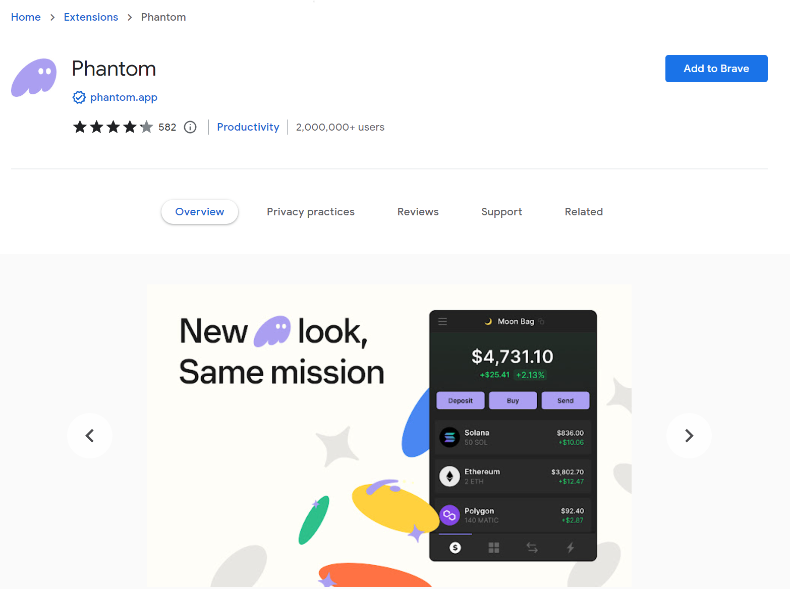
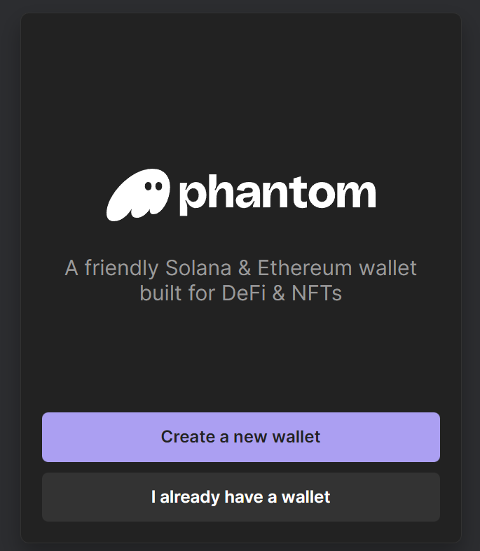
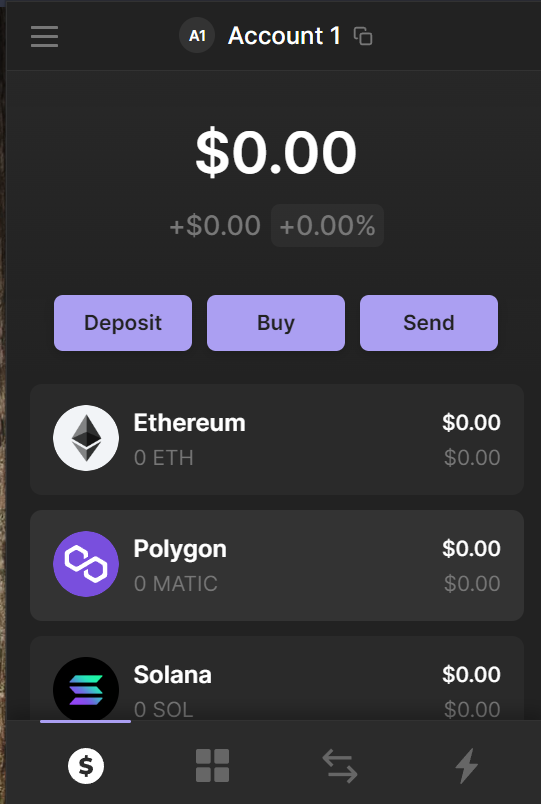
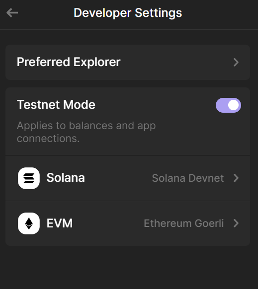
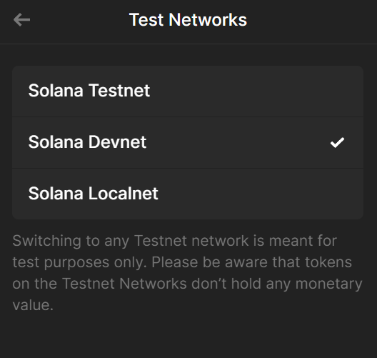
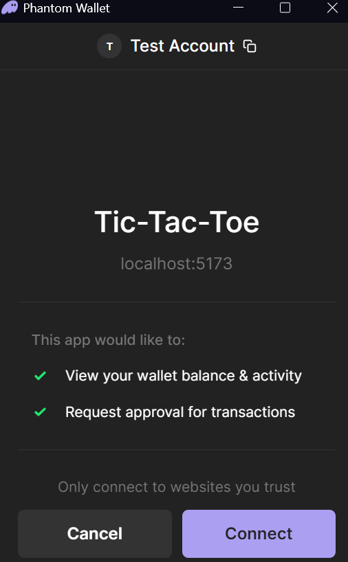
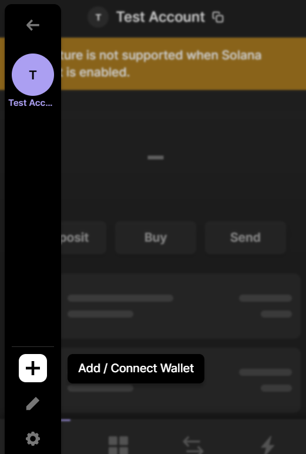
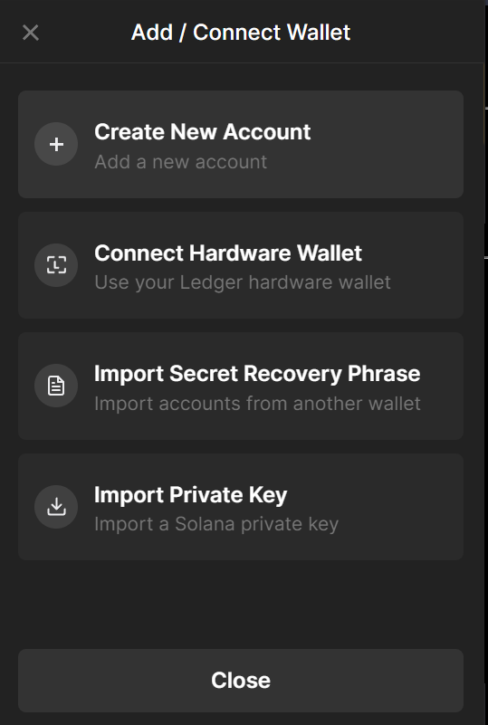
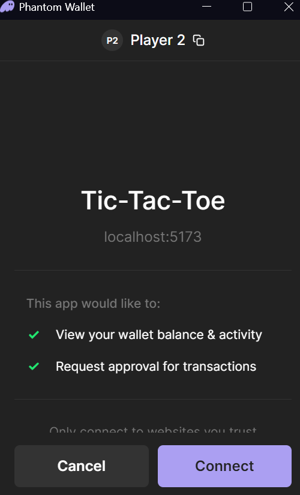

# Solana - Learn How to Build a Client-Side App: Part 2

## 1

### --description--

In this project, you will learn how to use the Phantom wallet browser extension to connect to your local validator, connect your wallet to a dApp, and sign transactions.

Change into the `learn-how-to-build-a-client-side-app-part-2/` directory in a new terminal.

### --tests--

You should be in the `learn-how-to-build-a-client-side-app-part-2/tic-tac-toe/` directory.

```js
const cwd = await __helpers.getLastCWD();
const dirRegex = new RegExp(`${project.dashedName}/tic-tac-toe/?$`);
assert.match(cwd, dirRegex);
```

## 2

### --description--

You have been started out with the same Tic-Tac-Toe Anchor program as the last project.

Previously, you manually copy-pasted the player keypairs into the client app. This is both insecure and a poor user experience.

## 50

### --description--

**Summary**:

1. Navigate to https://phantom.app/
2. Install the Phantom browser extension
   
   
   
   
   
   
   
   
   
   
   
   
   
3. Start validator:

```bash
solana-test-validator --bpf-program "program-id" ./tic_tac_toe.so --reset
```

4. Get public key:
   
5. Airdrop
6. Navigate to app
7. Connect wallet
   
8. Create second wallet:





9. Rename wallets to Player 1 and Player 2


10. Airdrop to player 2

11. Connect player 2 to app



## --fcc-end--
